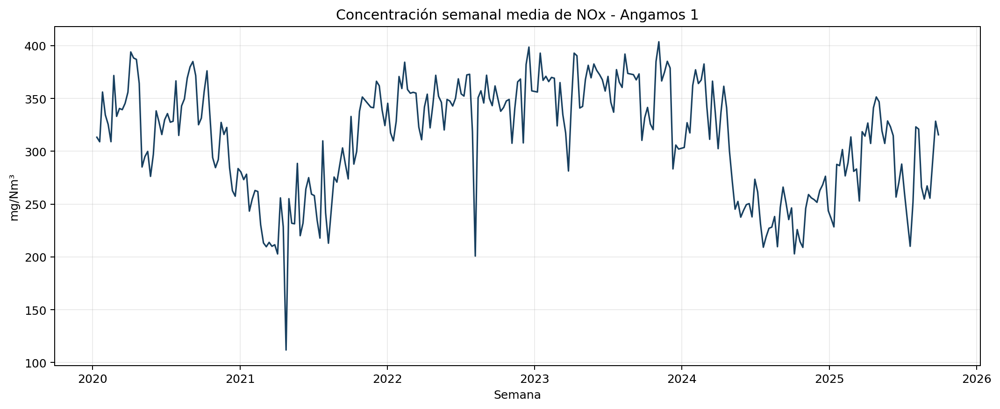
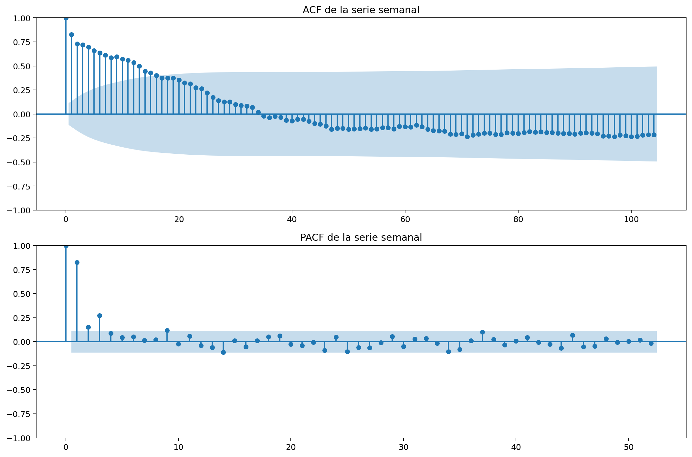
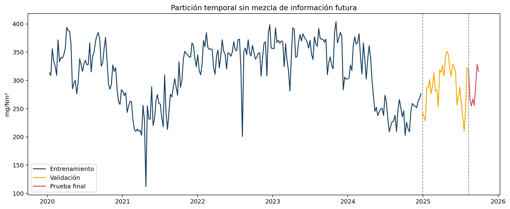
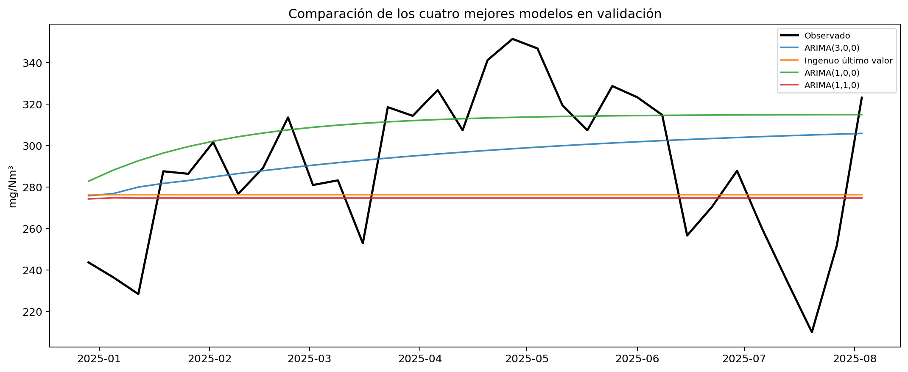
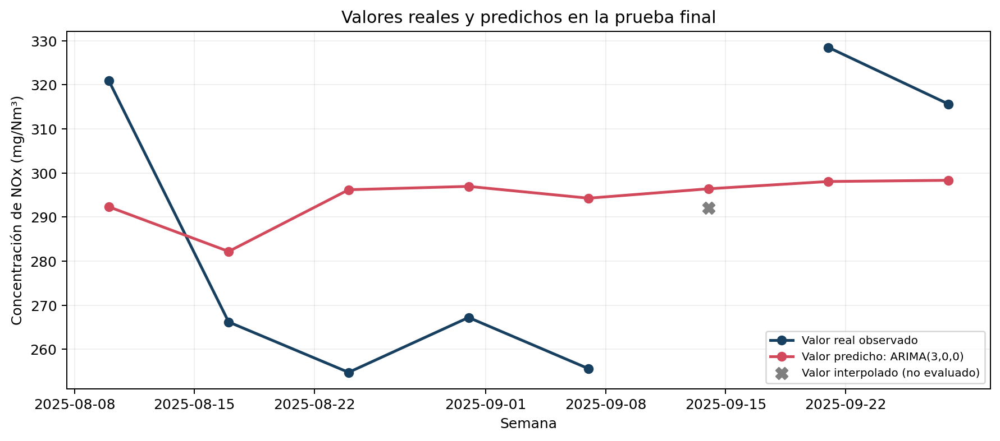
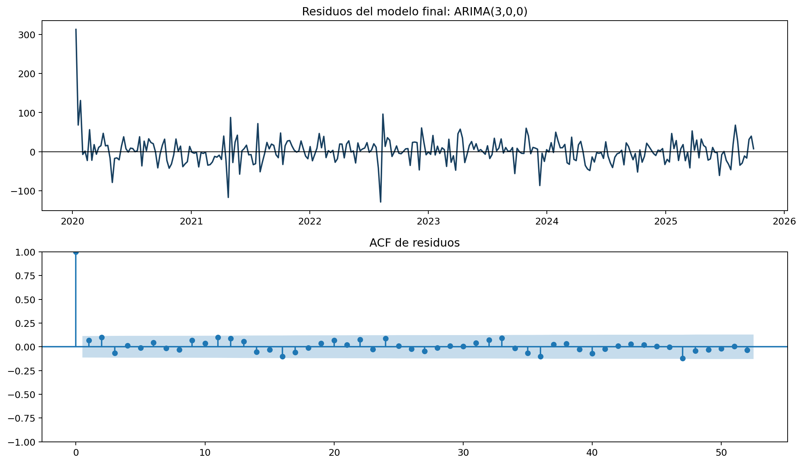
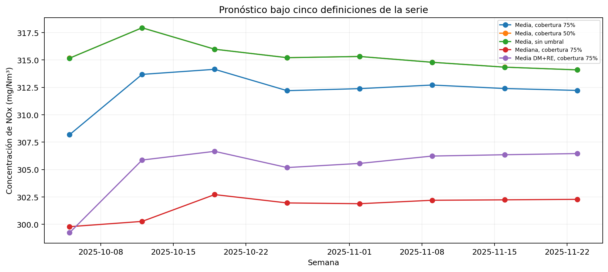

# Resumen ejecutivo

Este trabajo modela la concentración semanal media de óxidos de nitrógeno (NOx) de la unidad Angamos 1, empleando registros horarios publicados por el Sistema Nacional de Información de Fiscalización Ambiental (SNIFA) de la Superintendencia del Medio Ambiente de Chile. La colección local contiene 50.400 observaciones entre el 1 de enero de 2020 y el 30 de septiembre de 2025.

Después de auditar la cobertura y construir una serie semanal, se compararon doce alternativas pertenecientes a las familias estudiadas en la asignatura. Se seleccionó ARIMA(3,0,0), propuesto a partir de la PACF. La selección exigió primero residuos compatibles con ruido blanco y luego el menor RMSE de validación. El bloque de prueba mantuvo ocho semanas cronológicas, pero los errores se calcularon sobre las siete realmente observadas: RMSE de 30,23 mg/Nm³ y MAE de 28,89 mg/Nm³. El diagnóstico final de Ljung-Box no encontró autocorrelación residual significativa. El pronóstico central de las ocho semanas siguientes se mantiene aproximadamente entre 308 y 314 mg/Nm³, con intervalos predictivos del 95% que se amplían conforme aumenta el horizonte.

# 1. Contextualización

La Superintendencia del Medio Ambiente publica en SNIFA datos abiertos reportados por centrales termoeléctricas en el marco del D.S. N.º 13/2011. Los archivos contienen promedios horarios de contaminantes atmosféricos y variables operacionales. Para este análisis se seleccionó la central `ANGAMOS`, chimenea `ANGAMOS`, unidad generadora `ANGAMOS 1` y la variable `CONCENTRACION_NOX_MG_NM3`.

Esta variable representa concentración de NOx en mg/Nm³, corregida por oxígeno y expresada en base seca. No representa masa total emitida, por lo que los resultados no deben interpretarse en toneladas ni como inventario total de emisiones.

La fuente advierte que los registros son reportados por los regulados y no necesariamente han sido procesados, analizados o verificados por la SMA. Por esa razón, la auditoría y las reglas de calidad forman parte central del trabajo.

# 2. Objetivos

## Objetivo general

Modelar y pronosticar la concentración semanal media reportada y medida (`DM`) de NOx de la unidad Angamos 1, considerando todos los estados operacionales, mediante la comparación de modelos de series de tiempo con criterios explícitos y la generación de un pronóstico de ocho semanas con intervalos predictivos del 95%.

## Objetivos específicos

1. Auditar continuidad, duplicados, códigos de calidad y cobertura de los registros horarios.
2. Construir una serie semanal regular y documentar el tratamiento de semanas incompletas.
3. Describir nivel, variabilidad, estacionalidad y autocorrelación de la serie.
4. Comparar baselines, suavizamiento exponencial y modelos ARIMA mediante validación temporal.
5. Evaluar si el modelo seleccionado es apropiado mediante diagnóstico de residuos.
6. Reservar un bloque final de ocho semanas, medir el desempeño sólo sobre sus observaciones reales y generar el pronóstico futuro.

# 3. Datos y preparación

Se procesaron 23 archivos trimestrales en formato CSV, codificados como UTF-16 little-endian, con separador de punto y coma y coma decimal. Los archivos cubren desde el primer trimestre de 2020 hasta el tercer trimestre de 2025.

La lectura se realizó por bloques para no cargar simultáneamente cerca de 3 GB. Se normalizaron nombres, se filtró Angamos 1 y se convirtió la fecha mediante el formato ISO `%Y-%m-%d %H:%M:%S`. La conversión numérica reemplazó explícitamente la coma decimal.

## 3.1 Auditoría

| Indicador | Resultado |
|---|---:|
| Archivos procesados | 23 |
| Registros de Angamos 1 | 50.400 |
| Fechas inválidas | 0 |
| Registros fecha-hora duplicados | 0 |
| Datos medidos (`DM`) | 48.574 (96,38%) |
| Datos sustituidos (`DS`) | 1.826 (3,62%) |
| Semanas formadas inicialmente | 301 |
| Semanas que superan reglas de cobertura y borde | 289 (96,01%) |

Los estados operacionales observados fueron `RE` (operación en régimen), `HE` (horas de encendido), `HA` (horas de apagado), `FA` (falla), `DP` (detención programada) y `DNP` (detención no programada). La mayor proporción correspondió a `RE` (93,67%). Estas definiciones y los códigos de calidad se verificaron en la Guía del Sistema de Información para Centrales Termoeléctricas aprobada por la Resolución Exenta SMA N.º 404/2017. En `TIPO_DATO_NOX`, `DM` significa dato medido y `DS`, dato sustituido.

El objetivo principal se definió como la concentración semanal media **reportada y medida**, con independencia del estado operacional. Por ello se conservaron todos los registros `DM` y se excluyeron los `DS`. Restringir el análisis a `DM+RE` respondería a una pregunta distinta —la concentración condicionada a operación en régimen— y se evaluó por separado como sensibilidad.

## 3.2 Agregación semanal

La concentración es una magnitud intensiva y no debe sumarse. Se calculó la media de las observaciones horarias válidas en semanas terminadas en domingo. Se exigió un mínimo de 126 horas, equivalente al 75% de una semana de 168 horas.

Las dos semanas parciales de los extremos fueron excluidas. Para conservar un índice temporal regular se interpolaron diez semanas interiores con cobertura insuficiente; todos los vacíos fueron aislados o tuvieron una extensión máxima de dos semanas. La serie final contiene 299 semanas entre el 12 de enero de 2020 y el 28 de septiembre de 2025.

# 4. Análisis exploratorio

{width=90%}

> **Advertencia de interpretación:** los valores corresponden a concentración de NOx en los gases de chimenea de la unidad Angamos 1, corregida por oxígeno y expresada en base seca. No representan la concentración de NOx en el aire ambiente ni la exposición de la población de Mejillones.

La concentración semanal presentó una media de 312,24 mg/Nm³ y una desviación estándar de 52,68 mg/Nm³. Se observan cambios de nivel y episodios de volatilidad, pero no una tendencia monotónica permanente.

{width=90%}

La descomposición con periodo 52 describe movimientos de baja frecuencia y un patrón intraanual, pero ese periodo fue impuesto para explorar la serie y no demuestra por sí solo una estacionalidad anual estable. La ACF y la PACF muestran dependencia principalmente de corto plazo; el rezago 52 no presenta un aporte claro. Por ello no se impuso una estructura autorregresiva anual.

{width=90%}

La prueba Dickey-Fuller aumentada produjo en nivel un estadístico de -2,852 y valor p de 0,051. El resultado es limítrofe: al 5% no se rechaza formalmente la hipótesis de raíz unitaria. En primera diferencia, el valor p fue prácticamente cero. Siguiendo el procedimiento utilizado en el material del curso, se compararon candidatos ARIMA con `d=0` y `d=1`, y se utilizó la validación temporal junto con el diagnóstico residual para seleccionar el modelo.

# 5. Estrategia de validación

La serie se dividió cronológicamente en entrenamiento, validación de 32 semanas y prueba final de 8 semanas. La prueba se mantuvo completamente fuera de la selección.

{width=90%}

Se compararon doce alternativas:

- ingenuo de último valor;
- ingenuo estacional de 52 semanas;
- drift;
- suavizamiento exponencial simple;
- Holt amortiguado;
- ETS aditivo con periodo 52, como comparación estacional;
- ARIMA(1,0,0) y ARIMA(3,0,0), propuestos desde la PACF en nivel;
- ARIMA(1,1,0), ARIMA(2,1,0), ARIMA(0,1,1) y ARIMA(0,1,2), propuestos desde el ADF y la ACF/PACF de la primera diferencia.

La regla se fijó antes de observar la prueba final: un modelo debía superar Ljung-Box al 5% y, entre los candidatos apropiados, se escogería el menor RMSE de validación. MAE, MAPE y sMAPE se utilizaron como medidas complementarias. El AIC se informó únicamente como referencia dentro de modelos probabilísticos y no para ordenar familias diferentes.

El marco metodológico se restringió al material de la asignatura. Los modelos ingenuos, el suavizamiento exponencial y la validación temporal se trabajaron en el Tutorial 2; ACF, PACF y modelos AR se revisaron en los Tutoriales 3 y 6; Ljung-Box se utilizó en el Tutorial 4; y la formulación, comparación y diagnóstico de modelos ARIMA se aplicó en la tarea *Modelos ARMA* y en las Ayudantías 2 y 3. No se incorporaron familias de modelos ajenas a ese material.

# 6. Comparación de modelos

| Modelo | RMSE | MAE | MAPE (%) | sMAPE (%) | Ljung-Box p(10) |
|---|---:|---:|---:|---:|---:|
| **ARIMA(3,0,0)** | **35,99** | **29,24** | **10,80** | **10,23** | **0,529** |
| Ingenuo último valor | 38,93 | 33,40 | 11,51 | 11,71 | <0,001 |
| ARIMA(1,0,0) | 39,10 | 29,49 | 11,35 | 10,33 | 0,226 |
| ARIMA(1,1,0) | 39,52 | 34,01 | 11,66 | 11,93 | 0,266 |
| Drift | 39,91 | 34,09 | 11,65 | 11,96 | <0,001 |
| ARIMA(2,1,0) | 40,63 | 35,00 | 11,90 | 12,29 | 0,850 |
| ARIMA(0,1,1) | 41,89 | 36,11 | 12,19 | 12,70 | 0,804 |
| SES | 41,93 | 36,15 | 12,20 | 12,71 | 0,077 |
| Holt amortiguado | 42,35 | 36,46 | 12,28 | 12,83 | 0,078 |
| ARIMA(0,1,2) | 45,28 | 38,92 | 12,97 | 13,75 | 0,974 |
| ETS aditivo 52 | 50,22 | 39,01 | 12,93 | 13,87 | 0,227 |
| Ingenuo estacional 52 | 60,39 | 50,50 | 17,49 | 16,98 | <0,001 |

ARIMA(3,0,0) obtuvo el menor RMSE de validación y sus residuos superaron Ljung-Box al 5%. El ingenuo de último valor quedó segundo, pero conservó dependencia temporal clara en sus errores. De acuerdo con la regla definida previamente, se seleccionó ARIMA(3,0,0). El AIC se interpretó solamente entre modelos ARIMA comparables y no entre familias diferentes.

{width=90%}

# 7. Prueba final y adecuación

Una vez seleccionado ARIMA(3,0,0), se reentrenó con entrenamiento más validación y se pronosticó el bloque reservado de ocho semanas. Una de esas semanas carecía de cobertura suficiente y había sido interpolada. Para no evaluar el modelo contra un valor construido, las métricas se calcularon sobre las siete semanas realmente observadas.

| Métrica | Resultado |
|---|---:|
| RMSE | 30,23 mg/Nm³ |
| MAE | 28,89 mg/Nm³ |
| MAPE | 10,32% |
| sMAPE | 10,03% |

{width=85%}

La separación entre ambas curvas confirma que el pronóstico no reproduce exactamente cada observación. El MAPE de 10,32% indica que el error absoluto representó, en promedio, cerca del 10% del valor observado. El bloque de prueba se mantuvo exclusivamente para evaluación: reajustar la selección después de examinarlo convertiría esa prueba en una segunda validación y debilitaría la medición fuera de muestra.

Posteriormente el modelo se reentrenó con las 299 semanas. Ljung-Box produjo valores p de 0,572 y 0,308 para los rezagos 10 y 20. No se rechaza la ausencia de autocorrelación residual. Bajo este criterio, el modelo final se considera apropiado.

{width=90%}

# 8. Pronóstico

| Semana terminada en | Pronóstico | Límite inferior 95% | Límite superior 95% |
|---|---:|---:|---:|
| 2025-10-05 | 308,18 | 252,90 | 363,47 |
| 2025-10-12 | 313,68 | 247,38 | 379,99 |
| 2025-10-19 | 314,15 | 244,30 | 383,99 |
| 2025-10-26 | 312,20 | 236,93 | 387,46 |
| 2025-11-02 | 312,38 | 232,22 | 392,55 |
| 2025-11-09 | 312,71 | 229,29 | 396,14 |
| 2025-11-16 | 312,40 | 226,18 | 398,61 |
| 2025-11-23 | 312,22 | 223,49 | 400,95 |

{width=90%}

El nivel central pronosticado permanece relativamente estable. La amplitud creciente de los intervalos refleja que la incertidumbre se acumula con el horizonte.

La pauta utiliza la expresión “intervalo de confianza”. En este contexto se reporta un **intervalo predictivo del 95%**, porque incorpora la incertidumbre asociada a una observación semanal futura; no es solamente un intervalo para la media estimada.

<!-- SENSIBILIDAD_INICIO -->
# 8.1 Análisis de sensibilidad

Se evaluó el mismo modelo ARIMA(3,0,0) bajo cinco construcciones de la serie para determinar si la conclusión dependía del umbral de cobertura, las diez interpolaciones, el estadístico semanal o el estado operacional.

| Escenario | Semanas imputadas | RMSE validación | RMSE prueba | Ljung-Box p(10) | Pronóstico medio 8 semanas |
|---|---:|---:|---:|---:|---:|
| Media, cobertura 75% | 10 | 35,99 | 30,23 | 0,572 | 312,24 |
| Media, cobertura 50% | 1 | 36,20 | 29,97 | 0,699 | 315,36 |
| Media, sin umbral | 0 | 36,20 | 29,97 | 0,698 | 315,35 |
| Mediana, cobertura 75% | 10 | 43,42 | 35,08 | 0,761 | 301,67 |
| Media DM+RE, cobertura 75% | 25 | 35,44 | 25,78 | 0,142 | 305,19 |

ARIMA(3,0,0) mantuvo residuos compatibles con ruido blanco en todos los escenarios. Los escenarios de media con cobertura 50% y sin umbral fueron prácticamente idénticos y elevaron el pronóstico medio desde 312,24 hasta aproximadamente 315,35 mg/Nm³. La mediana redujo el nivel esperado a 301,67 mg/Nm³ y la restricción `DM+RE` a 305,19 mg/Nm³.

{width=90%}

Se conserva como especificación principal la media de datos medidos con cobertura mínima del 75% porque corresponde al objetivo definido antes del modelado. Aunque `DM+RE` obtuvo menor error en este bloque, responde a una pregunta distinta —concentración durante operación en régimen— y no reemplaza la especificación principal. La diferencia de nivel se reporta como limitación sustantiva.
<!-- SENSIBILIDAD_FIN -->

# 9. Conclusiones

La base disponible permitió construir una serie semanal de alta cobertura. Los modelos simples entregaron pronósticos competitivos, pero varios conservaron autocorrelación en los residuos. ARIMA(3,0,0), propuesto desde la PACF y comparado mediante validación temporal, obtuvo el menor RMSE y presentó residuos compatibles con ruido blanco.

En las siete semanas observadas del bloque de prueba, el error porcentual absoluto medio fue cercano al 10,3%. El modelo final se considera apropiado respecto de la blancura residual y permite proyectar la concentración media semanal con intervalos explícitos.

Los resultados no deben interpretarse como masa total emitida ni como evaluación normativa. Tampoco permiten establecer causalidad con potencia, combustible u otras variables operacionales. Las principales limitaciones son el carácter reportado y no necesariamente verificado de los datos, la interpolación de diez semanas y la mezcla de distintos estados operacionales en el estimando general. La sensibilidad `DM+RE` cuantifica parcialmente esta última limitación.

# Referencias y fuentes

- Material docente del curso *Series de Tiempo*: Tutoriales 2, 3, 4 y 6; tarea *Modelos ARMA*; Ayudantías 2 y 3.
- Superintendencia del Medio Ambiente. Sistema Nacional de Información de Fiscalización Ambiental, sección [Datos Abiertos de SNIFA](https://snifa.sma.gob.cl/DatosAbiertos).
- Superintendencia del Medio Ambiente. Colección pública de datos de centrales termoeléctricas bajo D.S. N.º 13/2011.
- Superintendencia del Medio Ambiente (2017). [Resolución Exenta N.º 404/2017](https://transparencia.sma.gob.cl/doc/resoluciones/RESOL_EXENTA_SMA_2017/RESOL%20EXENTA%20N%20404%20SMA.PDF), que aprueba la actualización de la Guía sobre el Sistema de Información para Centrales Termoeléctricas.
- Superintendencia del Medio Ambiente. [Descripción de los datos de la colección pública](https://drive.google.com/file/d/1A4ofyFi_Jq8aScbx0os99whqdTbL3WR3/view).
- Archivos trimestrales `PH2020-1` a `PH2025-3`, descargados y procesados en julio de 2026.

