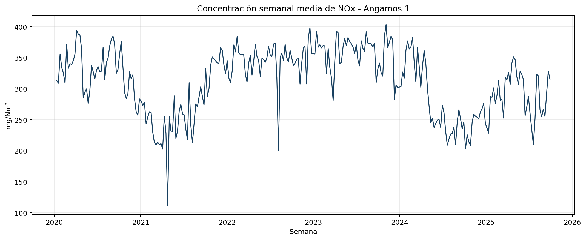
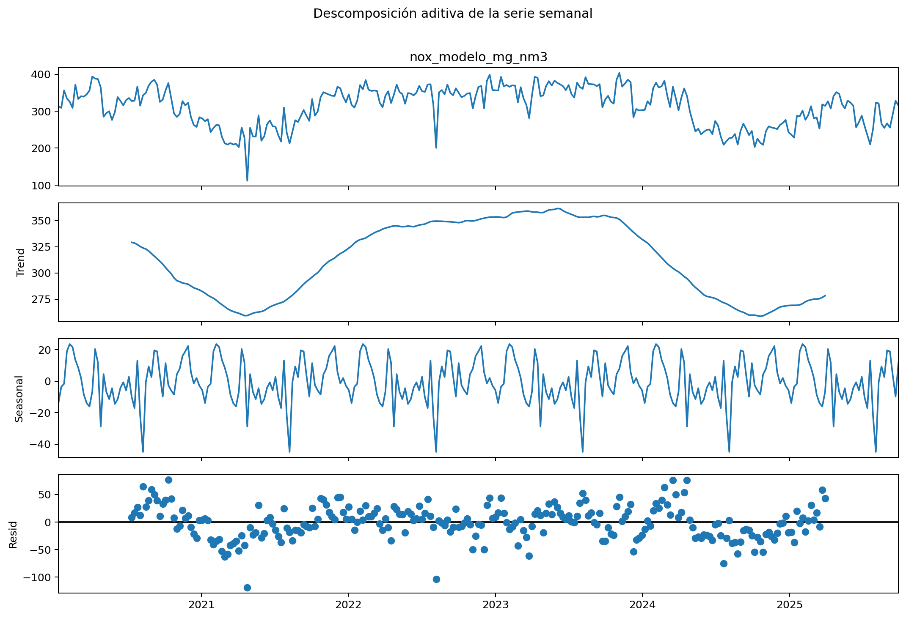
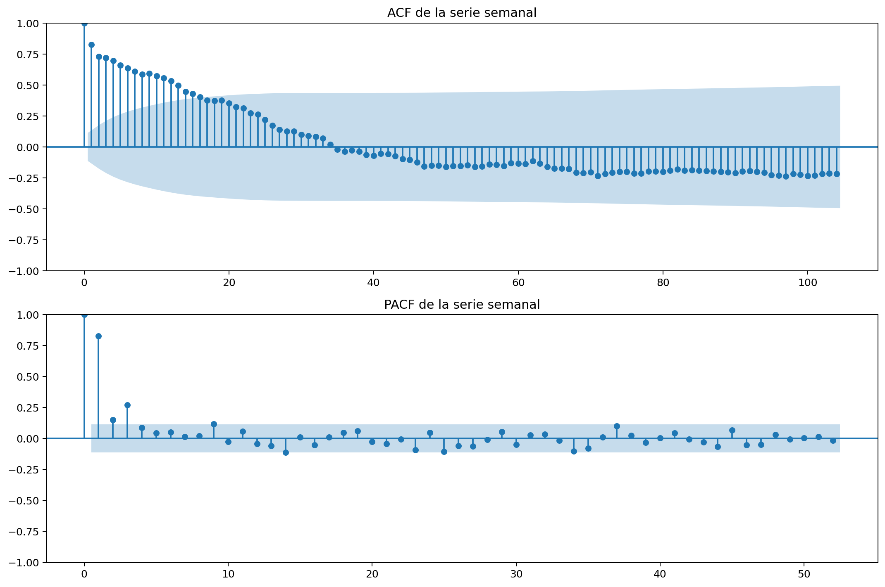
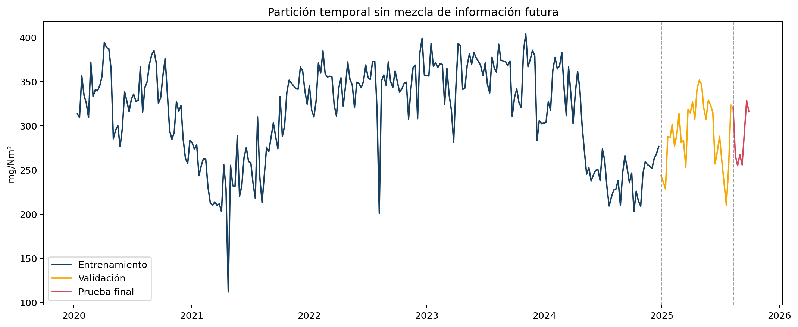
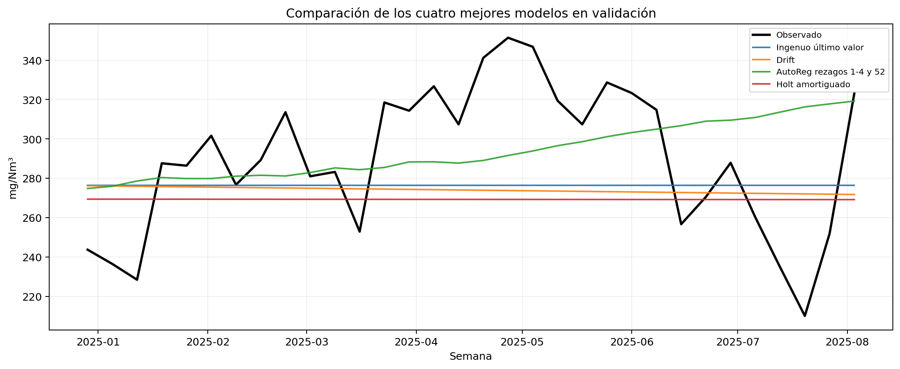
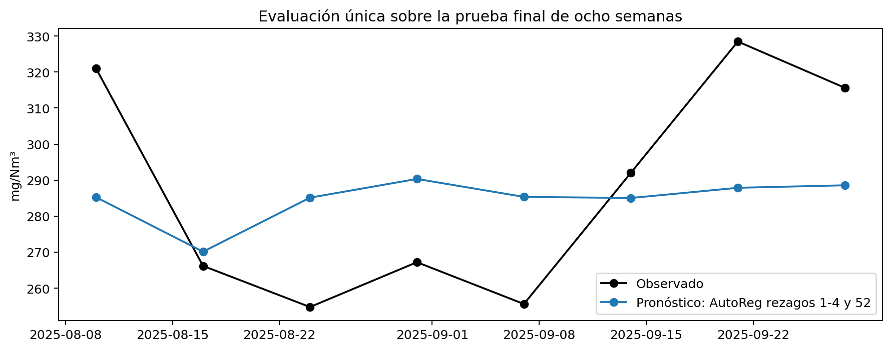
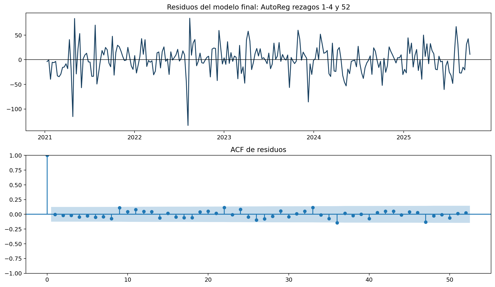
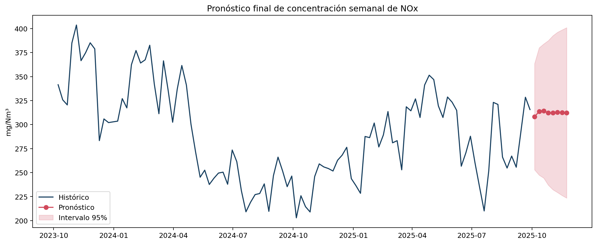
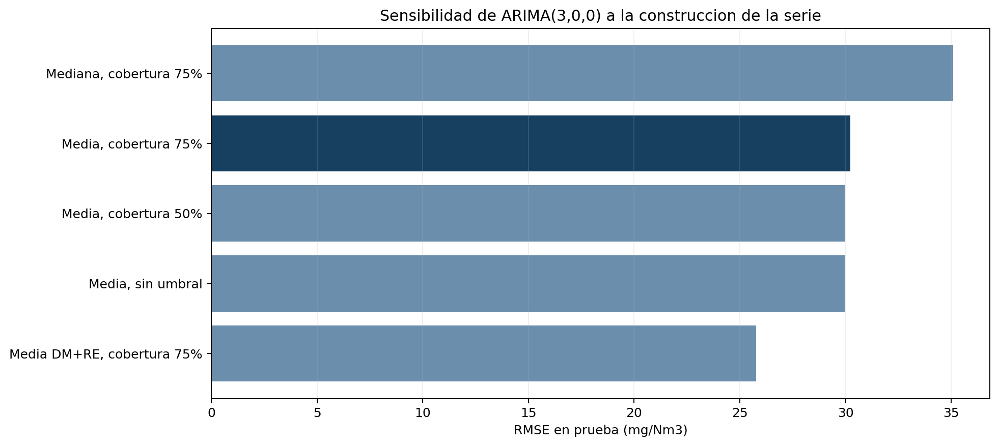
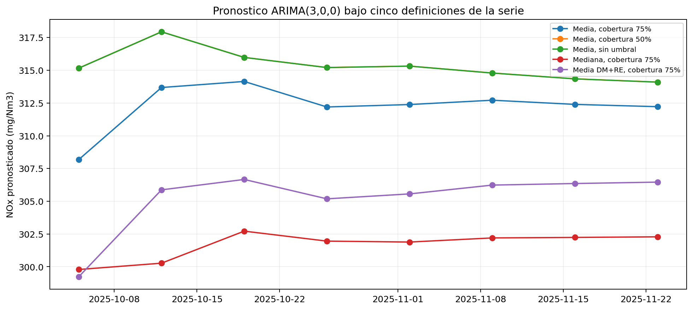

# Resumen ejecutivo

Este trabajo modela la concentración semanal media de óxidos de nitrógeno (NOx) de la unidad Angamos 1, empleando registros horarios publicados por el Sistema Nacional de Información de Fiscalización Ambiental (SNIFA) de la Superintendencia del Medio Ambiente de Chile. La colección local contiene 50.400 observaciones entre el 1 de enero de 2020 y el 30 de septiembre de 2025.

Después de auditar la cobertura, construir una serie semanal y comparar siete alternativas, se seleccionó un modelo autorregresivo con rezagos 1, 2, 3, 4 y 52. La selección exigió primero residuos compatibles con ruido blanco y luego el menor RMSE de validación. En una prueba final de ocho semanas, no utilizada para escoger el modelo, se obtuvo RMSE de 27,53 mg/Nm³ y MAE de 24,70 mg/Nm³. El diagnóstico final de Ljung-Box no encontró autocorrelación residual significativa. El pronóstico de las ocho semanas siguientes se mantiene aproximadamente entre 304 y 314 mg/Nm³, con intervalos predictivos del 95% que se amplían conforme aumenta el horizonte.

# 1. Contextualización

La Superintendencia del Medio Ambiente publica en SNIFA datos abiertos reportados por centrales termoeléctricas en el marco del D.S. N.º 13/2011. Los archivos contienen promedios horarios de contaminantes atmosféricos y variables operacionales. Para este análisis se seleccionó la central `ANGAMOS`, chimenea `ANGAMOS`, unidad generadora `ANGAMOS 1` y la variable `CONCENTRACION_NOX_MG_NM3`.

Esta variable representa concentración de NOx en mg/Nm³, corregida por oxígeno y expresada en base seca. No representa masa total emitida, por lo que los resultados no deben interpretarse en toneladas ni como inventario total de emisiones.

La fuente advierte que los registros son reportados por los regulados y no necesariamente han sido procesados, analizados o verificados por la SMA. Por esa razón, la auditoría y las reglas de calidad forman parte central del trabajo.

# 2. Objetivos

## Objetivo general

Modelar y pronosticar la concentración semanal media de NOx de la unidad Angamos 1 mediante técnicas de series de tiempo, comparando modelos con criterios explícitos y generando un pronóstico de ocho semanas con intervalos del 95%.

## Objetivos específicos

1. Auditar continuidad, duplicados, códigos de calidad y cobertura de los registros horarios.
2. Construir una serie semanal regular y documentar el tratamiento de semanas incompletas.
3. Describir nivel, variabilidad, estacionalidad y autocorrelación de la serie.
4. Comparar baselines, suavizamiento exponencial y modelos autorregresivos mediante validación temporal.
5. Evaluar si el modelo seleccionado es apropiado mediante diagnóstico de residuos.
6. Medir una sola vez el desempeño sobre ocho semanas de prueba y generar el pronóstico futuro.

# 3. Datos y preparación

Se procesaron 23 archivos trimestrales en formato CSV, codificados como UTF-16 little-endian, con separador de punto y coma y coma decimal. Los archivos cubren desde el primer trimestre de 2020 hasta el tercer trimestre de 2025.

La lectura se realizó por bloques para no cargar simultáneamente cerca de 3 GB. Se normalizaron nombres, se filtró Angamos 1 y se convirtió la fecha mediante el formato ISO `%Y-%m-%d %H:%M:%S`. La conversión numérica reemplazó explícitamente la coma decimal.

## 3.1 Auditoría

| Indicador | Resultado |
|---|---:|
| Archivos procesados | 23 |
| Registros de Angamos 1 | 50.400 |
| Fechas inválidas | 0 |
| Registros fecha-hora duplicados | 0 |
| Datos medidos (`DM`) | 48.574 (96,38%) |
| Datos sustituidos (`DS`) | 1.826 (3,62%) |
| Semanas formadas inicialmente | 301 |
| Semanas que superan reglas de cobertura y borde | 289 (96,01%) |

Los estados operacionales observados fueron `RE` (operación en régimen), `HE` (horas de encendido), `HA` (horas de apagado), `FA` (falla), `DP` (detención programada) y `DNP` (detención no programada). La mayor proporción correspondió a `RE` (93,67%). Estas definiciones y los códigos de calidad se verificaron en la Guía del Sistema de Información para Centrales Termoeléctricas aprobada por la Resolución Exenta SMA N.º 404/2017. En `TIPO_DATO_NOX`, `DM` significa dato medido y `DS`, dato sustituido.

El objetivo principal se definió como la concentración semanal media **reportada y medida**, con independencia del estado operacional. Por ello se conservaron todos los registros `DM` y se excluyeron los `DS`. Restringir el análisis a `DM+RE` respondería a una pregunta distinta —la concentración condicionada a operación en régimen— y se evaluó por separado como sensibilidad.

## 3.2 Agregación semanal

La concentración es una magnitud intensiva y no debe sumarse. Se calculó la media de las observaciones horarias válidas en semanas terminadas en domingo. Se exigió un mínimo de 126 horas, equivalente al 75% de una semana de 168 horas.

Las dos semanas parciales de los extremos fueron excluidas. Para conservar un índice temporal regular se interpolaron diez semanas interiores con cobertura insuficiente; todos los vacíos fueron aislados o tuvieron una extensión máxima de dos semanas. La serie final contiene 299 semanas entre el 12 de enero de 2020 y el 28 de septiembre de 2025.

# 4. Análisis exploratorio

{width=90%}

La concentración semanal presentó una media de 312,24 mg/Nm³ y una desviación estándar de 52,68 mg/Nm³. Se observan cambios de nivel y episodios de volatilidad, pero no una tendencia monotónica permanente.

{width=90%}

La descomposición sugiere movimientos de baja frecuencia y un componente anual, aunque la estabilidad de la estacionalidad no se asume únicamente a partir del gráfico. La ACF y la PACF muestran dependencia de corto plazo y señales alrededor del rezago anual de 52 semanas.

{width=90%}

La prueba Dickey-Fuller aumentada produjo un estadístico de -2,852 y valor p de 0,051. El resultado es limítrofe: al 5% no se rechaza formalmente la hipótesis de raíz unitaria. En lugar de decidir una diferenciación solo por este valor, se compararon modelos con distinta capacidad para representar persistencia y se utilizó el diagnóstico residual como criterio de adecuación.

# 5. Estrategia de validación

La serie se dividió cronológicamente en entrenamiento, validación de 32 semanas y prueba final de 8 semanas. La prueba se mantuvo completamente fuera de la selección.

{width=90%}

Se compararon siete alternativas:

- ingenuo de último valor;
- ingenuo estacional de 52 semanas;
- drift;
- suavizamiento exponencial simple;
- Holt amortiguado;
- ETS aditivo con periodo 52;
- AutoReg con rezagos 1, 2, 3, 4 y 52.

La regla se fijó antes de observar la prueba final: un modelo debía superar Ljung-Box al 5% y, entre los candidatos apropiados, se escogería el menor RMSE de validación. MAE, MAPE y sMAPE se utilizaron como medidas complementarias. El AIC se informó únicamente como referencia dentro de modelos probabilísticos y no para ordenar familias diferentes.

# 6. Comparación de modelos

| Modelo | RMSE | MAE | MAPE (%) | sMAPE (%) | Ljung-Box p(10) |
|---|---:|---:|---:|---:|---:|
| Ingenuo último valor | 38,93 | 33,40 | 11,51 | 11,71 | <0,001 |
| Drift | 39,91 | 34,09 | 11,65 | 11,96 | <0,001 |
| **AutoReg rezagos 1-4 y 52** | **40,02** | **31,98** | **11,76** | **11,14** | **0,773** |
| Holt amortiguado | 41,93 | 36,13 | 12,20 | 12,71 | 0,076 |
| SES | 41,93 | 36,15 | 12,20 | 12,71 | 0,077 |
| ETS aditivo 52 | 49,07 | 38,57 | 13,22 | 13,67 | <0,001 |
| Ingenuo estacional 52 | 60,39 | 50,50 | 17,49 | 16,98 | <0,001 |

El ingenuo obtuvo el menor RMSE, pero dejó dependencia temporal clara en los errores. No satisface el requisito de modelo apropiado. AutoReg quedó tercero por RMSE, obtuvo el menor MAE entre los candidatos competitivos y superó ampliamente Ljung-Box. Por ello fue seleccionado.

{width=90%}

# 7. Prueba final y adecuación

Una vez seleccionado AutoReg, se reentrenó con entrenamiento más validación y se evaluó sobre las ocho semanas reservadas.

| Métrica | Resultado |
|---|---:|
| RMSE | 27,53 mg/Nm³ |
| MAE | 24,70 mg/Nm³ |
| MAPE | 8,52% |
| sMAPE | 8,55% |

{width=85%}

Posteriormente el modelo se reentrenó con las 299 semanas. Ljung-Box produjo valores p de 0,713 y 0,801 para los rezagos 10 y 20. No se rechaza la ausencia de autocorrelación residual. Bajo este criterio, el modelo final se considera apropiado.

{width=90%}

# 8. Pronóstico

| Semana terminada en | Pronóstico | Límite inferior 95% | Límite superior 95% |
|---|---:|---:|---:|
| 2025-10-05 | 304,14 | 248,43 | 359,85 |
| 2025-10-12 | 309,75 | 244,61 | 374,90 |
| 2025-10-19 | 313,87 | 246,22 | 381,52 |
| 2025-10-26 | 312,18 | 240,50 | 383,85 |
| 2025-11-02 | 310,75 | 234,09 | 387,40 |
| 2025-11-09 | 311,27 | 231,20 | 391,34 |
| 2025-11-16 | 311,63 | 228,96 | 394,31 |
| 2025-11-23 | 311,34 | 226,17 | 396,52 |

{width=90%}

El nivel central pronosticado permanece relativamente estable. La amplitud creciente de los intervalos refleja que la incertidumbre se acumula con el horizonte.

<!-- SENSIBILIDAD_INICIO -->
# 8.1 Análisis de sensibilidad

Se evaluó el mismo modelo AutoReg bajo cinco construcciones de la serie para determinar si la conclusión dependía del umbral de cobertura, las diez interpolaciones, el estadístico semanal o el estado operacional.

| Escenario | Semanas imputadas | RMSE validación | RMSE prueba | Ljung-Box p(10) | Pronóstico medio 8 semanas |
|---|---:|---:|---:|---:|---:|
| Media, cobertura 75% | 10 | 40,02 | 27,53 | 0,713 | 310,62 |
| Media, cobertura 50% | 1 | 39,32 | 29,24 | 0,715 | 313,98 |
| Media, sin umbral | 0 | 39,28 | 29,27 | 0,713 | 313,94 |
| Mediana, cobertura 75% | 10 | 48,52 | 36,54 | 0,992 | 295,80 |
| Media DM+RE, cobertura 75% | 25 | 37,84 | 31,62 | 0,054 | 296,64 |

{width=90%}

La familia AutoReg mantuvo residuos compatibles con ruido blanco en todos los escenarios. Reducir el umbral al 50% o utilizar todas las medias semanales produjo resultados muy cercanos, por lo que las diez interpolaciones de la especificación principal no determinan por sí solas la conclusión. La mediana y la restricción al estado `RE` redujeron el nivel pronosticado y empeoraron el RMSE de prueba.

{width=90%}

Se conserva como especificación principal la media de datos medidos con cobertura mínima del 75% porque corresponde al objetivo de concentración semanal general y presenta el menor RMSE de prueba. La diferencia de nivel observada bajo `DM+RE` se reporta como limitación sustantiva y muestra que el pronóstico no debe reinterpretarse como concentración exclusiva durante operación en régimen.
<!-- SENSIBILIDAD_FIN -->

# 9. Conclusiones

La base disponible permitió construir una serie semanal de alta cobertura. Los modelos simples entregaron pronósticos competitivos, pero varios conservaron autocorrelación en los residuos. El modelo AutoReg con rezagos cortos y anual ofreció el mejor compromiso entre error fuera de muestra, parsimonia y adecuación residual.

En la prueba final, el error porcentual absoluto medio fue cercano al 8,5%. El modelo final se considera apropiado respecto de la blancura residual y permite proyectar la concentración media semanal con intervalos explícitos.

Los resultados no deben interpretarse como masa total emitida ni como evaluación normativa. Tampoco permiten establecer causalidad con potencia, combustible u otras variables operacionales. Las principales limitaciones son el carácter reportado y no necesariamente verificado de los datos, la interpolación de diez semanas y la mezcla de distintos estados operacionales en el estimando general. La sensibilidad `DM+RE` cuantifica parcialmente esta última limitación.

# Referencias y fuentes

- Superintendencia del Medio Ambiente. Sistema Nacional de Información de Fiscalización Ambiental, sección Datos Abiertos: <https://snifa.sma.gob.cl/DatosAbiertos>.
- Superintendencia del Medio Ambiente. Colección pública de datos de centrales termoeléctricas bajo D.S. N.º 13/2011.
- Superintendencia del Medio Ambiente (2017). Resolución Exenta N.º 404/2017, que aprueba la actualización de la Guía sobre el Sistema de Información para Centrales Termoeléctricas: <https://transparencia.sma.gob.cl/doc/resoluciones/RESOL_EXENTA_SMA_2017/RESOL%20EXENTA%20N%20404%20SMA.PDF>.
- Superintendencia del Medio Ambiente. *Descripción de los datos* de la colección pública: <https://drive.google.com/file/d/1A4ofyFi_Jq8aScbx0os99whqdTbL3WR3/view>.
- Archivos trimestrales `PH2020-1` a `PH2025-3`, descargados y procesados en julio de 2026.

